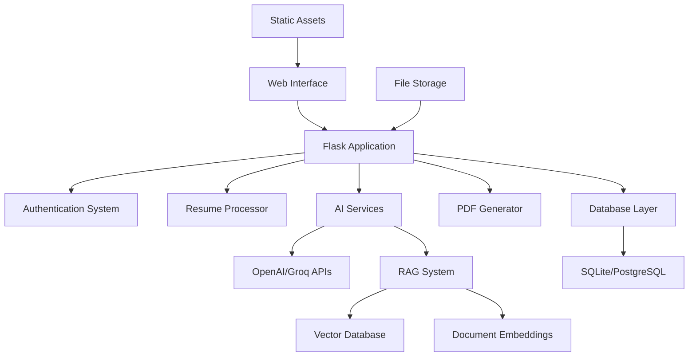

# 🎯 Smart ATS Tool

> **AI-Powered Applicant Tracking System with Resume Analysis, Interview Preparation & Hiring Intelligence**

[](https://python.org)
[](https://flask.palletsprojects.com/)
[](LICENSE)
[](CONTRIBUTING.md)

## 🌟 **Features**

### **For Job Applicants** 👨‍💼
- **🔍 Resume Analysis** - ATS compatibility scoring with detailed feedback
- **📝 Cover Letter Generator** - AI-powered personalized cover letters
- **🎤 Interview Preparation** - Dynamic question generation and practice
- **📊 Psychometric Testing** - Personality and workplace assessments
- **📄 Professional PDF Generation** - Multiple resume templates

### **For Recruiters** 👩‍💼
- **📈 Resume Ranking** - Bulk resume processing and scoring
- **🎯 Candidate Evaluation** - Comprehensive candidate reports
- **📋 Interview Question Bank** - Role-specific question generation
- **📊 Analytics Dashboard** - Hiring insights and metrics

### **For Companies** 🏢
- **🔄 Bulk Processing** - Handle hundreds of applications
- **📈 Hiring Analytics** - Data-driven recruitment insights
- **🎨 Custom Branding** - Personalized assessment experiences
- **🔗 API Integration** - Seamless workflow integration

## 🏗️ **Architecture**



### **🔧 Tech Stack**
- **Backend**: Flask 3.0+, Python 3.8+
- **AI/ML**: OpenAI GPT, Groq, LangChain, scikit-learn
- **Database**: SQLite (dev), PostgreSQL (prod)
- **Vector DB**: Pinecone (RAG system)
- **Frontend**: Bootstrap 5, HTML5, CSS3, JavaScript
- **PDF**: ReportLab, Pillow

## 🚀 **Quick Start**

### **Option 1: Automated Setup (Recommended)**
```bash
# Clone the repository
git clone https://github.com/yourusername/smart-ats-tool.git
cd smart-ats-tool

# Run automated setup
python scripts/complete_setup.py

# Start the application
py flask_app.py
```

### **Option 2: Manual Setup**
```bash
# Install dependencies
pip install -r requirements.txt

# Set up environment variables
cp env.example .env
# Edit .env with your API keys

# Initialize database
python scripts/init_vector_db.py

# Run the application
py flask_app.py
```

Visit `http://localhost:5000` to access the application.

## 📦 **Installation**

### **Prerequisites**
- Python 3.8 or higher
- pip package manager
- Git

### **Environment Variables**
Create a `.env` file with the following:

```env
# AI Service APIs
OPENAI_API_KEY=your_openai_api_key
GROQ_API_KEY=your_groq_api_key

# Vector Database (Pinecone)
PINECONE_API_KEY=your_pinecone_api_key
PINECONE_CLOUD=aws
PINECONE_REGION=us-east-1
PINECONE_INDEX_NAME=Yout_INDEX_NAME

# Database Configuration
DATABASE_URL=sqlite:///smart_ats.db
SECRET_KEY=your_secret_key_here

# File Upload Settings
MAX_CONTENT_LENGTH=16777216
UPLOAD_FOLDER=uploads

# Kaggle (for datasets)
KAGGLE_USERNAME=your_kaggle_username
KAGGLE_KEY=your_kaggle_key
```

## 🎭 **User Roles**

### **👨‍💼 Applicant Dashboard**
- Resume upload and analysis
- Cover letter generation
- Resume Generation
- Skill Analysis


### **👩‍💼 Recruiter Dashboard**
- Bulk resume processing
- Candidate ranking
- Psychometric assessments

### **🏢 Company Dashboard**
- Interview question generation
- 

## 🤖 **AI Features**

### **Resume Analysis Engine**
- **ATS Compatibility Scoring** - Industry-standard parsing
- **Keyword Optimization** - Job-specific recommendations
- **Format Analysis** - Professional layout suggestions
- **Content Enhancement** - Achievement quantification

### **Interview Assistant**
- **Dynamic Question Generation** - Role and level-specific
- **Behavioral Questions** - STAR method preparation
- **Technical Assessments** - Skill-based evaluations
- **Mock Interview Simulation** - Practice environment

### **RAG-Powered FAQ System**
- **Intelligent Q&A** - Context-aware responses
- **Career Guidance** - Personalized advice
- **Industry Insights** - Market trend analysis
- **Document Search** - Semantic similarity matching

## 📊 **API Documentation**

### **Authentication**
```bash
# Login to get session token
POST /login
{
  "username": "user@example.com",
  "password": "password"
}
```

### **Resume Operations**
```bash
# Analyze resume
POST /api/analyze_resume
Authorization: Bearer <token>
Content-Type: multipart/form-data

# Bulk resume ranking
POST /api/rank_resumes
Authorization: Bearer <token>
```

### **AI Services**
```bash
# Generate cover letter
POST /api/cover_letter
Authorization: Bearer <token>

# Interview questions
POST /api/interview_questions
Authorization: Bearer <token>

# Psychometric test
POST /api/psychometric_test
Authorization: Bearer <token>
```


### **Code Style**
- Follow PEP 8 for Python code
- Use meaningful variable names
- Add docstrings to functions
- Include type hints where appropriate


## 🙏 **Acknowledgments**

- OpenAI for GPT API
- Groq for fast inference
- LangChain for RAG framework
- Flask community for the web framework
- Bootstrap for UI components


---

<div align="center">
  <strong>⭐ Star this repository if you find it helpful!</strong>
  <br>
  <sub>Built with ❤️ for the developer community</sub>
</div> 
